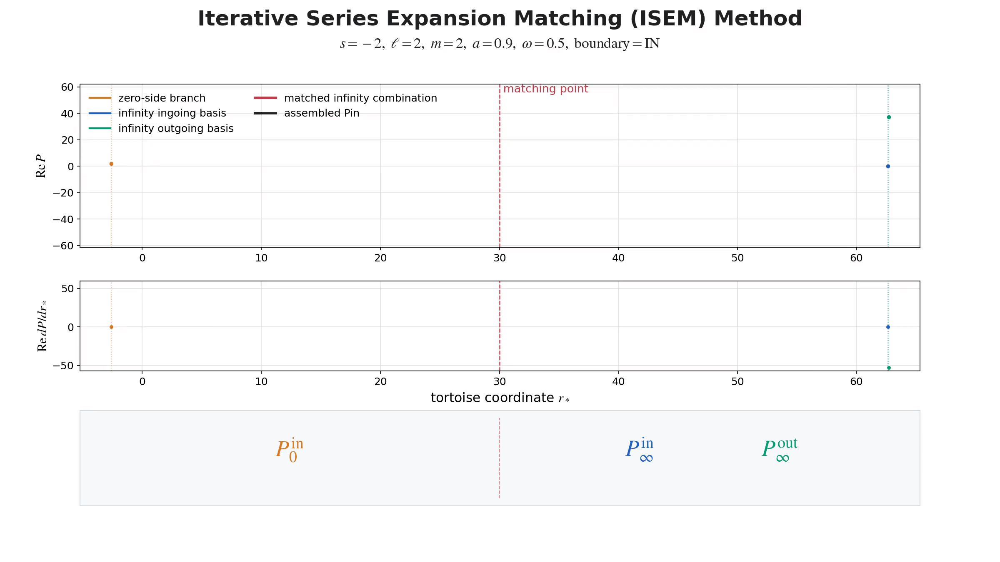

# GeneralizedSasakiNakamura.jl


[](https://github.com/ricokaloklo/GeneralizedSasakiNakamura.jl/releases)
[](http://ricokaloklo.github.io/GeneralizedSasakiNakamura.jl)

GeneralizedSasakiNakamura.jl computes solutions to the frequency-domain radial Teukolsky equation with the Generalized Sasaki-Nakamura (GSN) formalism.

The code is capable of handling *both ingoing and outgoing* radiation of scalar, electromagnetic, and gravitational type (corresponding to spin weight of $s = 0, \pm 1, \pm 2$ respectively).

The angular Teukolsky equation is solved with an accompanying julia package [SpinWeightedSpheroidalHarmonics.jl](https://github.com/ricokaloklo/SpinWeightedSpheroidalHarmonics.jl) using a spectral decomposition method.

Both codes are capable of handling *complex* frequencies, and we use $M = 1$ convention throughout.

The paper describing both the GSN formalism and the implementation can be found in [2306.16469](https://arxiv.org/abs/2306.16469). A set of Mathematica notebooks deriving all the equations used in the code can be found in [10.5281/zenodo.8080241](https://zenodo.org/records/8080242).

Starting from v0.8.0, the code is also capable of computing the gravitational waveform amplitude and fluxes at infinity and at the horizon due a test particle orbiting around a Kerr black hole in a _generic (eccentric, inclined) timelike bound orbit_ by solving the inhomogeneous SN equation using integration by parts.

Starting from v0.9.0, the package includes the ISEM solver, short for _iterative series expansion matching_. ISEM is now used by the default `method = "auto"` path where available and accelerates the homogeneous radial functions, single-mode point-particle amplitudes, and total-flux mode summations. The release also adds a high-level total-flux interface, `Teukolsky_pointparticle_flux`, which automatically selects the circular, eccentric, inclined, or generic mode-summation strategy.

For high-index tail modes in eccentric and generic flux summations, the ISEM path can use adaptive Levin quadrature instead of globally densifying a trapezoidal grid. The radial phase interval is refined only where the oscillatory integral has not stabilized. In generic two-dimensional convolutions, this radial adaptive Levin rule is combined with a fixed Clenshaw-Curtis rule in the polar direction, which resolves the smooth polar dependence with a compact cosine-spaced grid while keeping the expensive adaptivity in the radial direction.

## Installation
To install the package using the Julia package manager, simply type the following in the Julia REPL:
```julia
using Pkg
Pkg.add("GeneralizedSasakiNakamura")
```

*Note: There is no need to install [SpinWeightedSpheroidalHarmonics.jl](https://github.com/ricokaloklo/SpinWeightedSpheroidalHarmonics.jl) separately as it should be automatically installed by the package manager.*

## Highlights
### Two radial-solver paths
The package supports two complementary radial-solver paths:

- **Numerical path**: direct numerical integration of the radial equation using the `linear` or `Riccati` methods, with analytical near-boundary patches.
- **Semi-analytical path**: iterative series expansion matching, selected by `method = "ISEM"` or by the default `method = "auto"` path where available.

### Numerical solver path: linear/Riccati integration
The original GSN solver works at *both low and high frequencies* by numerically evolving the radial equation and attaching analytical boundary ansatzes near the horizon and infinity:

<p align="center">
  
</p>

The on-the-fly numerical-path benchmark against the Mathematica MST implementation is shown below:

<table>
  <tr>
    <th>GeneralizedSasakiNakamura.jl numerical path</th>
    <th><a href="https://github.com/BlackHolePerturbationToolkit/Teukolsky">Teukolsky</a> Mathematica package using the MST method </th>
  </tr>
  <tr>
    <td><p align="center"></p></td>
    <td><p align="center"></p></td>
  </tr>
</table>

*(There was no caching in this benchmark; the equation was solved on the fly. The notebook generating the speed animation can be found [here](https://github.com/ricokaloklo/GeneralizedSasakiNakamura.jl/blob/main/examples/realtime-demo.ipynb).)*

### Semi-analytical solver path: iterative series expansion matching
Starting from v0.9.0, the semi-analytical ISEM path constructs the Teukolsky and GSN radial functions directly from matched series expansions. This path is selected by `method = "ISEM"` or by `method = "auto"` where available. For real frequencies in the trained selector domain, ISEM chooses matching controls automatically and applies a local-`N` rescue scan when the split mismatch is above tolerance. If `method = "auto"` cannot obtain a reliable ISEM solution, it falls back to the legacy `linear` path. After warm-up, homogeneous radial solves are typically at millisecond scale or faster while retaining interactive evaluation over dense grids:

<p align="center">
  
</p>

The ISEM on-the-fly Teukolsky/GSN solve and evaluation benchmark is shown below:

<p align="center">
  
</p>

ISEM is also used in the accelerated single-mode point-particle amplitudes and total-flux mode summations where available.

Static/zero-frequency solutions are solved analytically with Gauss hypergeometric functions.

Superradiance-threshold solutions with $\omega = m a / (2 r_+)$ are handled by a dedicated horizon-threshold ISEM branch.

### Easy to use
The following code snippet lets you solve the (source-free) Teukolsky function (in frequency domain) for the mode $s=-2, \ell=2, m=2, a/M=0.7, M\omega=0.5$ that satisfies the purely-ingoing boundary condition at the horizon, $R^{\textrm{in}}$, and the purely-outgoing boundary condition at spatial infinity, $R^{\textrm{up}}$, respectively:
```julia
using GeneralizedSasakiNakamura # This is going to take some time to pre-compile, mostly due to DifferentialEquations.jl

# Specify which mode to solve
s=-2; l=2; m=2; a=0.7; omega=0.5;

# NOTE: julia uses 'just-ahead-of-time' compilation. Calling this the first time in each session will take some time
Rin, Rup = Teukolsky_radial(s, l, m, a, omega)
```
That's it! If you run this on Julia REPL, it should give you something like this
```
(
TeukolskyRadialFunction(
    mode = Mode(s = -2, l = 2, m = 2, a = 0.7, omega = 0.5, lambda = 1.696609401635342),
    boundary_condition = IN,
    transmission_amplitude = 1.0 + 0.0im,
    incidence_amplitude = 6.536587661185641 - 4.941203897066954im,
    reflection_amplitude = -0.128246619129162 - 0.44048133496455144im,
    normalization_convention = UNIT_TEUKOLSKY_TRANS
),
TeukolskyRadialFunction(
    mode = Mode(s = -2, l = 2, m = 2, a = 0.7, omega = 0.5, lambda = 1.696609401635342),
    boundary_condition = UP,
    transmission_amplitude = 1.0 + 0.0im,
    incidence_amplitude = -1.1698840333870053 - 2.545572334044037im,
    reflection_amplitude = 2.516990858632645 - 8.644964686262956im,
    normalization_convention = UNIT_TEUKOLSKY_TRANS
))
```
In Julia REPL, you can check out all the asymptotic amplitudes at a glimpse using something like
```julia
julia> Rin
TeukolskyRadialFunction(
    mode = Mode(s = -2, l = 2, m = 2, a = 0.7, omega = 0.5, lambda = 1.696609401635342),
    boundary_condition = IN,
    transmission_amplitude = 1.0 + 0.0im,
    incidence_amplitude = 6.536587661185641 - 4.941203897066954im,
    reflection_amplitude = -0.128246619129162 - 0.44048133496455144im,
    normalization_convention = UNIT_TEUKOLSKY_TRANS
)
```

For example, if we want to evaluate the Teukolsky function $R^{\textrm{in}}$ at the location $r = 10M$, simply do
```julia
Rin(10)
```
This should give
```
77.57508416826994 - 429.4029095225273im
```

#### Solving for complex frequencies
One can use the same interface to compute solutions with complex frequencies. For example, the QNM solution of the $s=-2, \ell=2, m=2, a/M=0.68$ fundamental tone can be obtained using
```julia
Rin, Rup = Teukolsky_radial(-2, 2, 2, 0.68, 0.5239751-0.0815126im)
```
We can check out the $R^{\textrm{up}}$ solution using
```julia
julia> Rup
TeukolskyRadialFunction(
    mode = Mode(s = -2, l = 2, m = 2, a = 0.68, omega = 0.5239751 - 0.0815126im, lambda = 1.6550030805786855 + 0.3602676563885877im),
    boundary_condition = UP,
    transmission_amplitude = 1.0 + 0.0im,
    incidence_amplitude = -5.7809684319307504e-8 - 3.809710730287814e-7im,
    reflection_amplitude = 1.1011632131894007 + 2.13005973884911im,
    normalization_convention = UNIT_TEUKOLSKY_TRANS
)
```
We see that the incidence amplitude is indeed very small numerically as a QNM solution should. This can be accessed using
```julia
Rup.incidence_amplitude
```

This should give
```julia
-5.7809684319307504e-8 - 3.809710730287814e-7im
```

#### Solving the inhomogeneous radial Teukolsky/SN equation with a point-particle source on a generic timelike bound orbit
This can now be done easily with this code.
Suppose we want to compute the inhomogeneous solution to the radial Teukolsky equation at infinity for the $s = -2$, $\ell = m = 2$ mode driven by a test particle on a bound geodesic with $a/M = 0.9, p = 6M, e = 0.7, x = \cos(\pi/4)$, one can simply do
```julia
mode_info = Teukolsky_pointparticle_mode(-2, 2, 2, 0, 0, 0.9, 6, 0.7, cos(π/4))
```
where $n = 0$ and $k = 0$ label the radial and polar modes, respectively.
To have a glimpse of the output, one can do so with
```julia
julia> mode_info
TeukolskyPointParticleMode(
    mode = Mode(s = -2, l = 2, m = 2, n = 0, k = 0, a = 0.9, omega = 0.06568724726732737, lambda = 3.6067890121199833),
    amplitude_inf = 0.00023429507956756622 - 6.5584144409953e-5im,
    energy_flux_inf = 1.0917330112997913e-6,
    angular_momentum_flux_inf = 3.32403337547931e-5,
    Carter_const_flux_inf = 5.890504443030812e-5,
    method = (method = "isem_trapezoidal", N = 256, K = 64),
)
```
To access for example the amplitude at infinity,
```julia
julia> mode_info.amplitude
0.00023429507956756622 - 6.5584144409953e-5im
```
which is the value for $Z^{\infty}_{\ell m n k}$, the amplitude of the inhomogeneous radial Teukolsky solution near infinity for that particular frequency.

If we want to compute the inhomogeneous solution to the radial Teukolsky equation at the event horizon for the 
same set of parameters, we can simply change the sign of $s$ to $2$
```julia
mode_info = Teukolsky_pointparticle_mode(2, 2, 2, 0, 0, 0.9, 6, 0.7, cos(π/4))
```
The output should be
```julia
julia> mode_info
TeukolskyPointParticleMode(
    mode = Mode(s = 2, l = 2, m = 2, n = 0, k = 0, a = 0.9, omega = 0.06568724726732737, lambda = -0.3932109878800166),
    amplitude_hor = 0.006089946888798024 - 0.0014130019665199167im,
    energy_flux_hor = -2.8438148784387398e-9,
    angular_momentum_flux_hor = -8.658651402654361e-8,
    Carter_const_flux_hor = -1.5343956812899322e-7,
    method = (method = "isem_trapezoidal", N = 256, K = 64),
)
```
To access for example the amplitude at the horizon,
```julia
julia> mode_info.amplitude
0.006089946888798024 - 0.0014130019665199167im
```
which is the value for $Z^{\mathrm{H}}_{\ell m n k}$, the amplitude of the inhomogeneous radial Teukolsky solution near the horizon for that particular frequency.

Total fluxes can be computed with the orbit-aware high-level interface. A generic-orbit total-flux run can be substantially slower than an eccentric equatorial run because it performs two-dimensional convolution integrals.
```julia
julia> flux = Teukolsky_pointparticle_flux(0.9, 6.0, 0.7, 1.0; tol=1e-8)
TeukolskyPointParticleFlux(
    orbital_parameters(a = 0.9, p = 6.0, e = 0.7, x = 1.0),
    orbit_type = eccentric,
    infinity_energy_flux = 0.0007457786958522503,
    infinity_angular_momentum_flux = 0.006759517407137998,
    infinity_carter_constant_flux = 0.0,
    horizon_energy_flux = -8.777498498324929e-6,
    horizon_angular_momentum_flux = -7.361786698869744e-5,
    horizon_carter_constant_flux = 0.0,
    total_modes = 36876,
    n_reached = (infinity = 124, horizon = 58),
    convolution_integral = (strategy = "ISEM adaptive trapezoidal for n < 50; tail ISEM adaptive Levin for n >= 50", tail_levin_nmin = 50, tail_levin_max_depth = 8),
    tolerance = 1.0e-8,
    truncation_floor = (infinity = 1.0e-16, horizon = 1.0e-16),
    cost = 80.67165613174438 seconds,
)
```
This high-eccentricity equatorial run averaged about `2.188 ms` per computed mode.

```julia
julia> flux = Teukolsky_pointparticle_flux(0.9, 6.0, 0.7, 0.5; tol=1e-8)
TeukolskyPointParticleFlux(
    orbital_parameters(a = 0.9, p = 6.0, e = 0.7, x = 0.5),
    orbit_type = generic,
    infinity_energy_flux = 0.0024644958692019905,
    infinity_angular_momentum_flux = 0.012386764337831563,
    infinity_carter_constant_flux = 0.08159322177899339,
    horizon_energy_flux = -9.201171207869944e-6,
    horizon_angular_momentum_flux = -0.00036271546529366135,
    horizon_carter_constant_flux = 0.0009653138446262085,
    total_modes = 725608,
    n_reached = (infinity = 267, horizon = 95),
    convolution_integral = (strategy = "ISEM adaptive trapezoidal for n < 50; tail ISEM adaptive Levin for n >= 50", tail_levin_nmin = 50, tail_levin_max_depth = 8),
    tolerance = 1.0e-8,
    truncation_floor = (infinity = 1.0e-16, horizon = 1.0e-16),
    cost = 6723.135498046875 seconds,
)
```
This high-eccentricity generic run averaged about `9.265 ms` per computed mode.

The function automatically dispatches to circular, eccentric, inclined, or generic mode summation according to the supplied orbital parameters.

In the high-`n` tail, eccentric and generic summations can switch from uniform-grid trapezoidal sampling to adaptive Levin quadrature. For generic two-dimensional convolutions, the default accelerated tail path uses adaptive Levin in the radial direction and Clenshaw-Curtis sampling in the polar direction, reducing the need for a uniformly dense two-dimensional grid.

## How to cite
If you have used this code in your research that leads to a publication, please cite the following article:
```
@article{Lo:2023fvv,
    author = "Lo, Rico K. L.",
    title = "{Recipes for computing radiation from a Kerr black hole using a generalized Sasaki-Nakamura formalism: Homogeneous solutions}",
    eprint = "2306.16469",
    archivePrefix = "arXiv",
    primaryClass = "gr-qc",
    doi = "10.1103/PhysRevD.110.124070",
    journal = "Phys. Rev. D",
    volume = "110",
    number = "12",
    pages = "124070",
    year = "2024"
}
```

Additionally, if you have used this code's capability to solve for solutions with complex frequencies, please also cite the following article:
```
@article{Lo:2025njp,
    author = "Lo, Rico K. L. and Sabani, Leart and Cardoso, Vitor",
    title = "{Quasinormal modes and excitation factors of Kerr black holes}",
    eprint = "2504.00084",
    archivePrefix = "arXiv",
    primaryClass = "gr-qc",
    doi = "10.1103/PhysRevD.111.124002",
    journal = "Phys. Rev. D",
    volume = "111",
    number = "12",
    pages = "124002",
    year = "2025"
}
```

If you have used this code's capability to solve for the gravitational waveform amplitudes and fluxes at infinity and at horizon with a test particle orbiting a Kerr black hole in a generic timelike bound and stable orbit (e.g., for extreme mass ratio inspiral waveforms), please cite the following articles:
```
@article{Yin:2025kls,
    author = "Yin, Yucheng and Lo, Rico K. L. and Chen, Xian",
    title = "{Gravitational radiation from Kerr black holes using the Sasaki-Nakamura formalism: waveforms and fluxes at infinity}",
    eprint = "2511.08673",
    archivePrefix = "arXiv",
    primaryClass = "gr-qc",
    doi = "10.1103/9ngz-k1lr",
    journal = "Phys. Rev. D",
    volume = "113",
    pages = "124007",
    year = "2026"
}

@article{Lo:2025lpo,
    author = "Lo, Rico K. L. and Yin, Yucheng",
    title = "{Near-horizon gravitational perturbations of rotating black holes}",
    eprint = "2512.07937",
    archivePrefix = "arXiv",
    primaryClass = "gr-qc",
    doi = "10.1103/bljh-l413",
    journal = "Phys. Rev. D",
    volume = "113",
    number = "6",
    pages = "L061505",
    year = "2026"
}
```


## License
The package is licensed under the MIT License.
